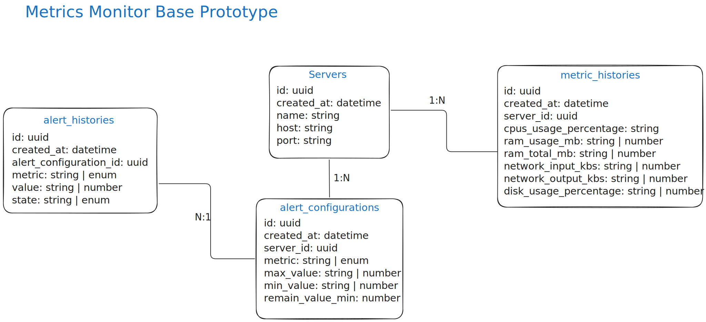

# Metrics Monitor App

This is a simple metrics monitor using Flask with python. It allows users to view and manage their metrics in a
user-friendly interface.

## Setup

1. Clone the repository:

    ```bash
    git clone git@github.com:Maur025/aplicaciones-internet-examen-flask-uab.git
    ```

   Or its HTTPS version:

   ```bash
   git clone https://github.com/Maur025/aplicaciones-internet-examen-flask-uab.git
   ```

2. Navigate to the project directory:

   ```bash
   cd aplicaciones-internet-examen-flask-uab
   ```

3. Install dependencies with uv:

   ```bash
   uv sync
   ```
4. Use to `.env` file in IDE or export the environment variables in `env.sh` with command:

   ```bash
   source env.sh
   ```
5. Run the application:
   ```bash
   flask run
   ```

   Or:

   ```bash
   uv run run.py
   ```

   Or:

   ```bash
   python3 run.py
   ```

## APP CREDENTIALS

Username and password to prototype the app in fab:

- Username: admin
- Password: Admin123.

## Prototype Model

